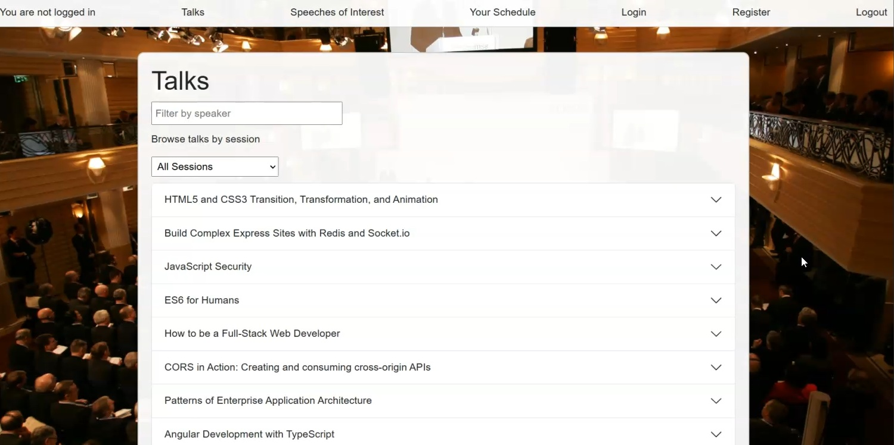
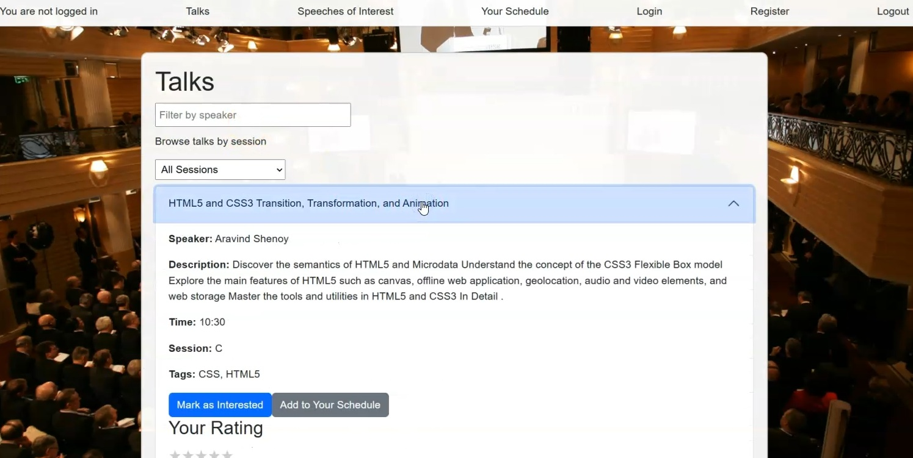
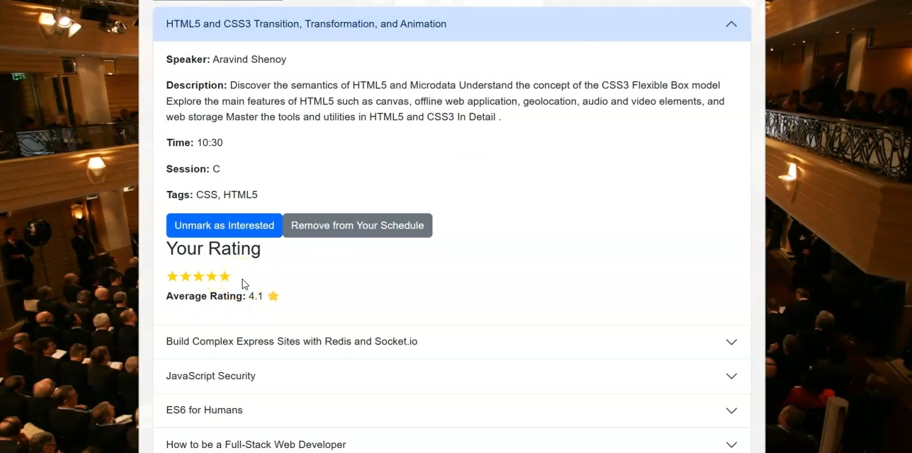

# Conference Event Planner

## Overview

This application is a responsive single-page application (SPA) designed to enhance the experience of technology conference attendees. The application provides a comprehensive platform for users to explore conference schedules, discover talks and presenters, and meticulously plan their event itinerary. The primary goal is to offer an intuitive and efficient tool for attendees to manage their time, prioritize sessions, and engage with the conference content effectively.

---

## Key Features

* **Speaker Search**: Easily find talks by searching for specific speakers.
* **Session Browse**: Navigate and view the schedule of talks organized by conference sessions.
* **Personalized Itinerary**:
    * Mark talks of potential interest to build a preliminary list.
    * Create and view an individualized schedule of chosen talks, ensuring no time conflicts.
    * Store and review your personal itinerary, with the ability to set priorities for talks.
* **Talk Ratings**: Rate talks you've attended and see the average rating for each talk based on feedback from all users.
* **Responsive Design**: Access and use the application seamlessly across various devices, including desktops, tablets, and smartphones.

---

## Technology Stack

This application leverages modern web technologies to deliver a dynamic and user-friendly experience:

* **Frontend Framework**:
    * **React**: A JavaScript library for building user interfaces. [cite: 15]
    * **React Hooks**: Utilizes Hooks such as `useState`, `useEffect`, and others for managing component state, side effects, and context, enabling functional components with robust capabilities.
    * The project can be initialized using standard tools like Create React App, Vite, or a custom Webpack/Parcel setup. [cite: 32, 33]
* **Backend API**:
    * The frontend application interfaces with a **Node.js/Express API**. This API serves as the data source, providing necessary endpoints for fetching and managing conference information such as talks, sessions, speakers, and user ratings.
* **Application Type**: **Single-Page Application (SPA)**, ensuring a smooth and fast user experience without full page reloads. [cite: 8]
* **Browser Compatibility**: Designed to be fully functional in Google Chrome and other modern, standards-compliant web browsers. [cite: 14]